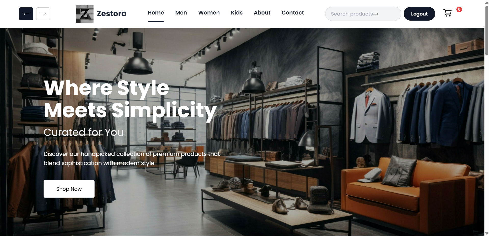
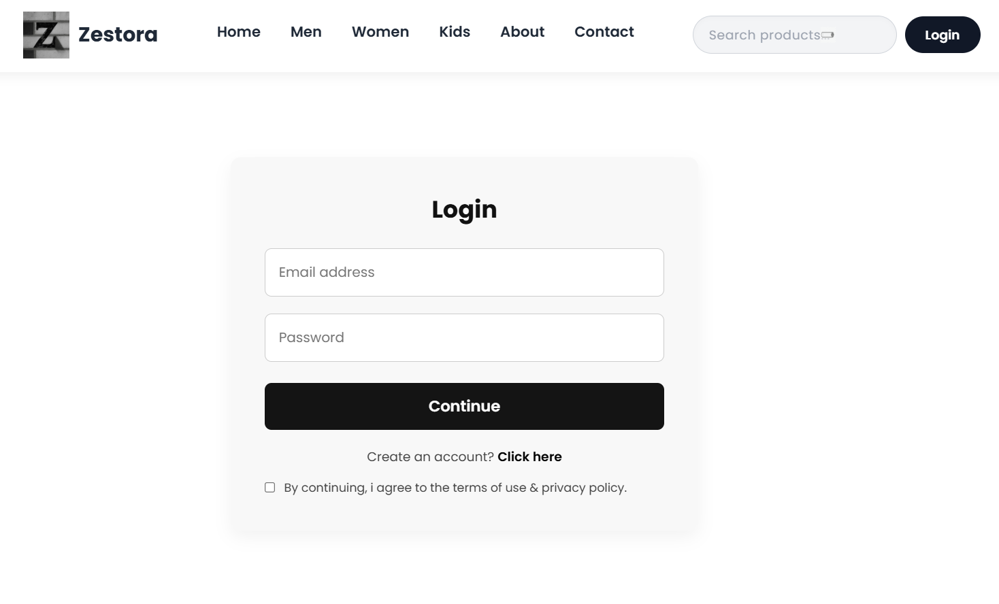
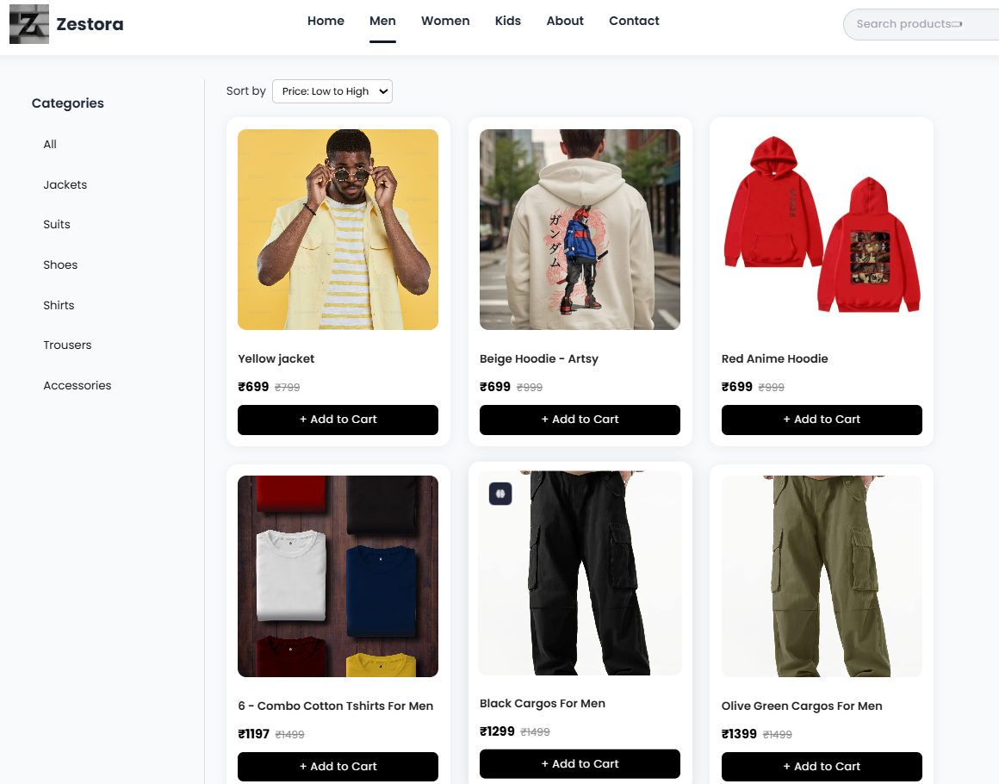
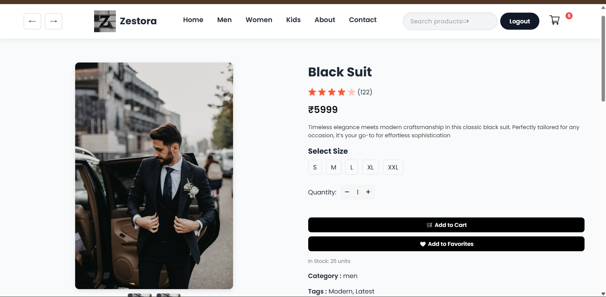
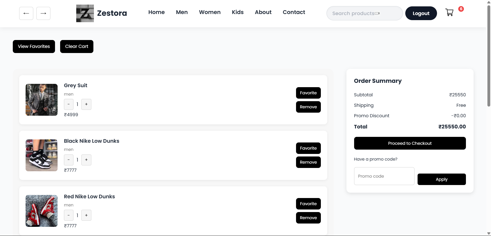
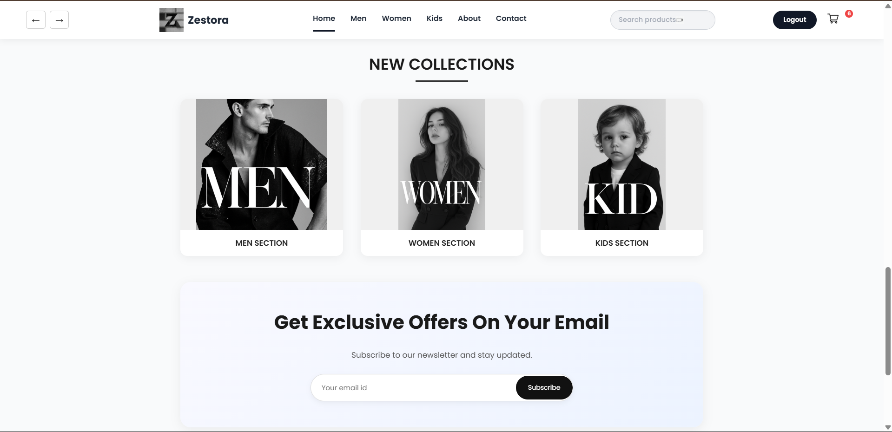
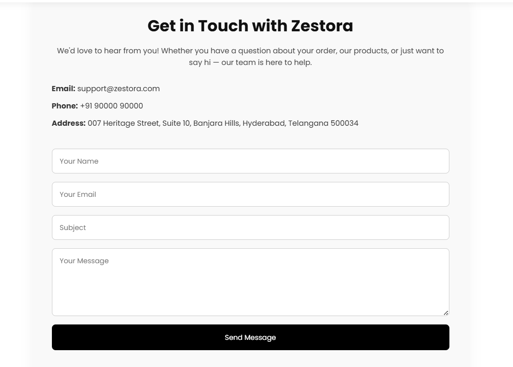

# E-Commerce Web Application

## Overview  
A full-stack e-commerce platform built using the MERN stack, providing users with a seamless online shopping experience. The application supports user authentication, product browsing, cart and checkout functionalities, and includes a modern responsive UI. It also features admin-side controls for managing products and collections.

---

## Key Features  

- **User Authentication**: Sign up, log in, and manage sessions securely.
- **Product Catalog**: Browse a dynamic catalog with product images, pricing, and details.
- **Shopping Cart**: Add/remove items, update quantity, and proceed to checkout.
- **Admin Dashboard**: For adding new collections, updating product information.
- **Order Flow**: Place simulated orders with a streamlined user interface.
- **Responsive Design**: Fully mobile-friendly using modern layout strategies.
  
---

## Technology Stack

| Category            | Tools/Technologies                         |
|---------------------|--------------------------------------------|
| Frontend            | React.js, Tailwind CSS                     |
| Backend             | Node.js, Express.js                        |
| Database            | MongoDB with Mongoose                      |
| Authentication      | JWT, bcrypt                                |
| State Management    | React Context, Redux                       |
| Deployment          | Render, Vercel, Netlify                    |

---

## Output Screenshots

### Homepage  


### Login Page  


### Products Page  


### Product Details Page  


### Cart Page  


### New Collection Page  


### About Page  


### Contact Page  


---

## How to Run the Project

### 1. Clone the Repository

```bash
git clone https://github.com/ASHRITH-SAMBARAJU/E-COMMERCE-APPLICATION.git
cd E-COMMERCE-APPLICATION
```
### 2. Install Dependencies

Frontend

```bash
cd frontend
npm install
npm start
```
Backend 

```bash
cd ../backend
npm install
npm run dev
```
---

---

## Contact

For questions, feedback, or collaboration:

**Ashrith Sambaraju**  
  Email: [ashrithsambaraju@gmail.com](mailto:ashrithsambaraju@gmail.com)  
  LinkedIn: [linkedin.com/in/ashrith-sambaraju](https://www.linkedin.com/in/ashrith-sambaraju)

---


